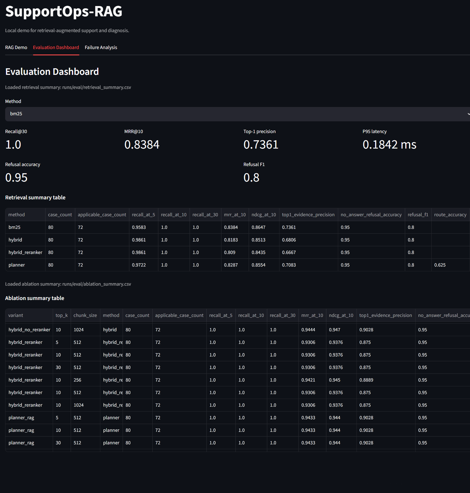
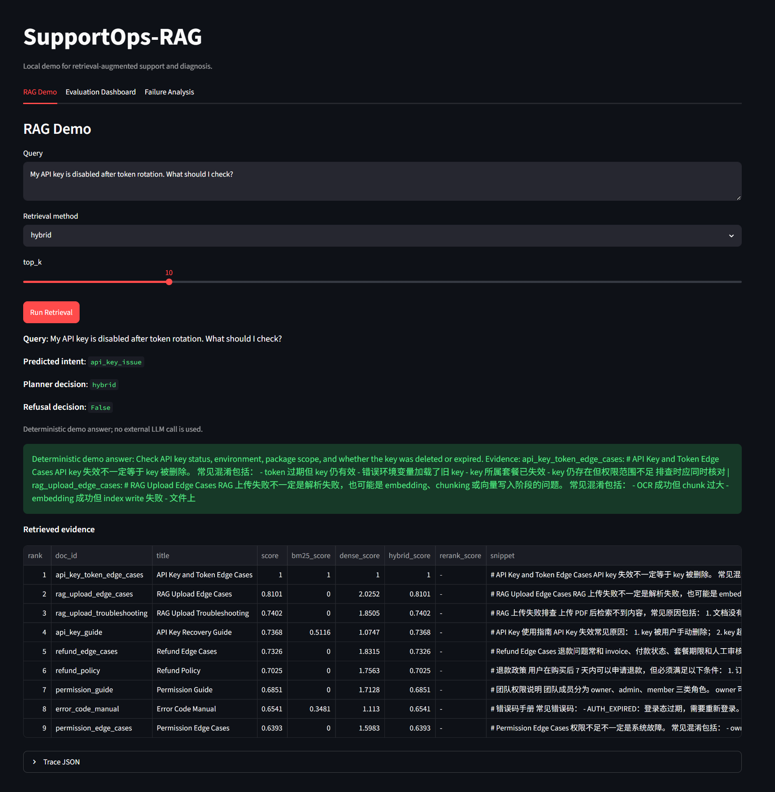
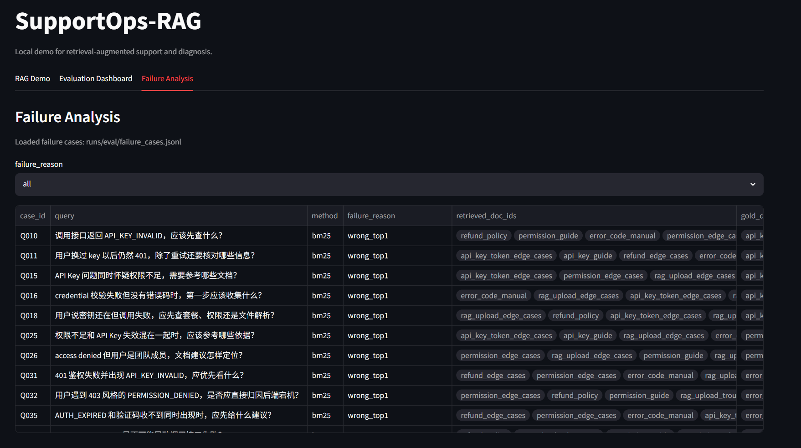

# SupportOps-RAG

## Project Overview

构建面向客服知识库、产品文档与运维工单的检索增强问答与故障诊断系统，针对长文档切分、关键词与语义错配、证据不足导致的错误自信回答及多文档故障定位困难，设计混合检索、证据重排、可控检索决策与可追踪评测机制，提升系统证据召回、拒答可靠性与诊断可解释性。

## Motivation

这个仓库不是聊天机器人 demo，而是一个可本地复现的 RAG / Agentic Retrieval 评测系统。
重点在于：

- 路由是否选对意图；
- 检索是否召回关键证据；
- no-answer 是否可靠拒答；
- planner 是否会误路由；
- trace 和 failure case 是否能回放。

## Key Features

- BANKING77 router 评测，支持官方数据集加载与评测流程，并提供离线 sample fixture 回退；支持 rule baseline 和 TF-IDF + LogisticRegression baseline。
- SupportOpsBench 检索与故障诊断评测，支持 BM25、BGE Embedding / dense retriever、FAISS-HNSW、Hybrid、Hybrid + Cross-Encoder Reranker、Planner-RAG。
- 纯本地 trace 输出，包含 case 级检索结果、路由决策、拒答决策和失败原因。
- 消融实验输出 CSV / JSON，可直接用于汇报或简历整理。
- 兼容离线环境，BANKING77 可用 sample fixture 回退。

## Dataset

- `BANKING77`: 用于客服意图路由评测，默认尝试从 Hugging Face `PolyAI/banking77` 加载。
- `SupportOpsBench`: 用于客服 / 运维 RAG 检索、多文档诊断、无答案拒答和安全边界评测。

SupportOpsBench 当前通过 `evals/supportops_bench.yaml` 提供 80 个 seed case，并在 loader 中升级为：

- `id`, `query`, `intent`, `difficulty`
- `gold_doc_ids`, `gold_answer`, `no_answer`
- `requires_multi_doc`, `tags`

文档通过 `data/docs/*.md` 自动加载并升级为：

- `doc_id`, `title`, `text`, `source`, `tags`

## Pipeline

1. Router 判断意图。
2. 检索层执行 BM25 / Dense Embedding / Hybrid / Cross-Encoder Reranker / Planner。
3. Verifier 和 refusal policy 过滤低置信结果。
4. 输出 trace、summary 和 failure cases。

## Evaluation Metrics

- `Recall@5 / @10 / @30`
- `MRR@10`
- `nDCG@10`
- `Top-1 evidence precision`
- `no-answer refusal accuracy`
- `refusal F1`
- `P50 / P95 latency`

## How to Run

Router eval:

```bash
python scripts/run_router_eval.py --dataset banking77 --max-samples 1000 --output runs/eval/banking77_router_report.json
```

Offline fallback:

```bash
python scripts/run_router_eval.py --dataset banking77 --max-samples 1000 --sample-path data/banking77_sample.jsonl --output runs/eval/banking77_router_report.json
```

Retrieval eval:

```bash
python scripts/run_retrieval_eval.py --dataset supportops --methods bm25,hybrid,hybrid_reranker,planner --output-dir runs/eval
```

Ablation:

```bash
python scripts/run_ablation.py --dataset supportops --output-dir runs/eval
```

Smoke test:

```bash
python scripts/run_retrieval_eval.py --dataset supportops --methods bm25,hybrid --output-dir runs/eval_smoke
```

## Demo UI

Install the optional demo and retrieval extras first if needed:

```bash
pip install -e .[demo,retrieval]
```

启动本地可视化页面：

```bash
python -m streamlit run app/streamlit_app.py --server.port 8501
```

浏览器访问：

```text
http://localhost:8501
```

如果在 WSL 中运行，Windows 浏览器通常也可以直接访问 `localhost:8501`。如果无法访问，再尝试：

```bash
python -m streamlit run app/streamlit_app.py --server.address 0.0.0.0 --server.port 8501
```

页面包含三个部分：

- `RAG Demo`: query 输入、retrieval method 切换、top-k 控制、evidence 列表、refusal decision、deterministic demo answer、trace JSON。
- `Evaluation Dashboard`: 自动读取 `runs/eval/` 或 `runs/eval_smoke/` 的 retrieval summary 和 ablation summary。
- `Failure Analysis`: 自动读取 failure cases，支持按 `failure_reason` 过滤。

## Results

### Reproduced local seed results

本地 SupportOpsBench seed benchmark 已实际运行，结果文件位于 `runs/eval/`。这些数字来自本地内存检索设置，不代表线上服务延迟。

- `bm25`: Recall@30 100.00%, MRR@10 0.8384, Top-1 evidence precision 73.61%, P95 latency 0.1190 ms.
- `dense`: Recall@30 100.00%, MRR@10 0.8615, Top-1 evidence precision 77.78%.
- `hybrid`: Recall@30 100.00%, MRR@10 0.4904, Top-1 evidence precision 31.94%.
- `hybrid_reranker`: Recall@30 100.00%, MRR@10 0.8064, Top-1 evidence precision 69.44%.
- `planner`: Route accuracy 62.50%, MRR@10 0.9433, P95 latency 0.3523 ms.
- `no-answer refusal`: accuracy 0.95, F1 0.80.

### Smoke test results

`runs/eval_smoke/` 已生成 smoke 产物，用于验证脚本、trace 和结果落盘。

### Pending official BANKING77 full evaluation

项目支持 BANKING77 官方数据集加载与评测流程。
当前仓库内置 `data/banking77_sample.jsonl` 作为离线 smoke fallback；正式的 BANKING77 全量评测结果尚未在当前仓库中产出，因此不在这里声称完成官方全量评测。

## Ablation Study

`runs/eval/ablation_summary.json` 和 `runs/eval/ablation_summary.csv` 已生成，包含：

- BM25 only
- Dense only
- Hybrid
- Hybrid without reranker
- Hybrid with reranker
- Planner-RAG
- Planner-RAG without verifier
- top-k sweep: 5 / 10 / 30
- chunk size sweep: 256 / 512 / 1024

## Hybrid Alpha Sweep

在客服 / 运维场景里，API Key、token、错误码、权限字段等强关键词对 BM25 很重要，而语义改写和隐式描述又会让 dense retrieval 更稳。简单线性融合可能在 hard-negative 场景下退化，所以需要扫 alpha 找到更合适的权重。

```bash
python scripts/run_ablation.py --dataset supportops --alpha-sweep 0,0.2,0.4,0.6,0.8,1.0 --output-dir runs/eval_alpha
```

`alpha = 1.0` 表示更偏 BM25，`alpha = 0.0` 表示更偏 dense。输出见 `runs/eval_alpha/alpha_sweep_summary.csv` 和 `runs/eval_alpha/alpha_sweep_summary.json`。

## Trace and Failure Analysis

- `runs/eval/trace.jsonl`
- `runs/eval/failure_cases.jsonl`
- `runs/eval/retrieval_summary.json`
- `runs/eval/retrieval_summary.csv`

每条 trace 包含 `case_id`, `query`, `method`, `intent`, `retrieved_doc_ids`, `gold_doc_ids`, `hit_at_5`, `hit_at_10`, `mrr_at_10`, `latency_ms`, `planner_decision`, `refusal_decision`, `failure_reason`。

## Resume Summary

- 项目已经支持 SupportOpsBench 与 BANKING77 两条评测链路；其中 BANKING77 当前可在离线 sample fixture 下完成 smoke 验证，正式全量评测待后续运行。
- SupportOpsBench 本地 seed 评测已产出真实 JSON / CSV / JSONL 结果，可直接用于简历和复盘。

## BANKING77 Router Evaluation

The project supports BANKING77 intent-router evaluation. In the official full test split evaluation (`train_size=10003`, `test_size=3080`), the TF-IDF + LogisticRegression router reached **Accuracy 0.8929** and **Macro-F1 0.8940**, outperforming the rule baseline (**Accuracy 0.2951**, **Macro-F1 0.2933**). The evaluation report also records confusion cases for intent-level error analysis.

Run command:

```bash
python scripts/run_router_eval.py \
  --dataset banking77 \
  --no-fallback \
  --max-samples 0 \
  --output runs/eval_banking77_full/banking77_router_report_full.json \
  --confusion-out runs/eval_banking77_full/banking77_confusion_cases_full.jsonl

## Demo Screenshots

### RAG Demo



### Evaluation Dashboard



### Failure Analysis



